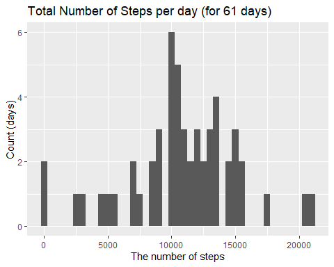
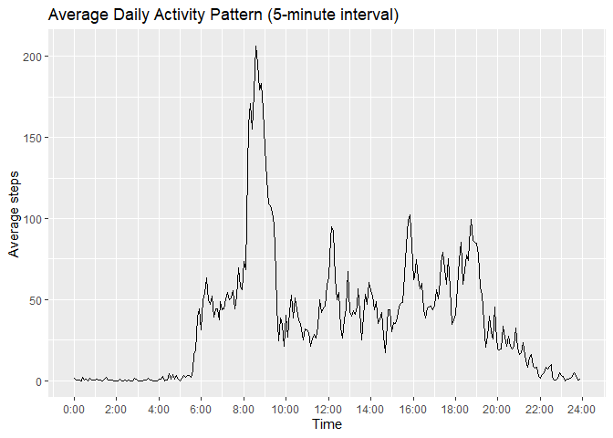
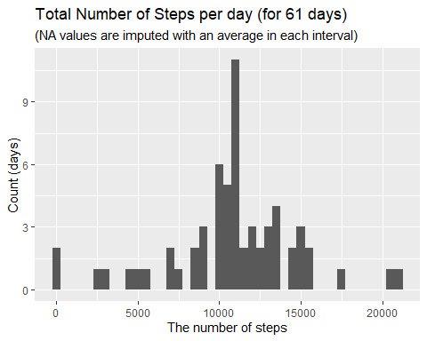
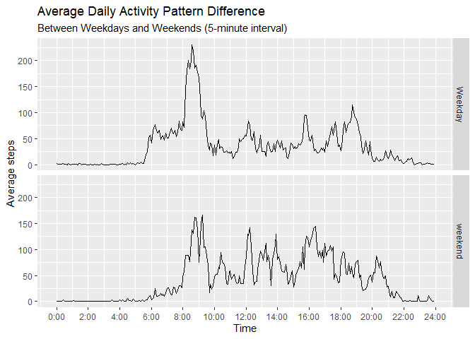

## Loading and preprocessing the data  


```r
library(dplyr); library(lubridate); library(ggplot2); library(xtable)
unzip('activity.zip')
data_init <- read.csv('activity.csv')

# Transform the dataframe 
# new column 'time': a interval column is transformed to a time series
data <- data_init %>%
  mutate(date=ymd(date)) %>%
  mutate(time=rep(hms::as_hms(seq(from=0,to=24*60*60-1,by=300)),times=61)) 
```

## What is mean total number of steps taken per day?
1.Calcullate the total number of steps taken per day.  


```r
# Remove NA rows so that total 0 does not show in the graph
dataNaRemoved <- data[!is.na(data$steps),] 
byDate <- group_by(dataNaRemoved, date)
totalSteps <- summarize(byDate, total=sum(steps))
totalSteps$date <- as.character(totalSteps$date)
xt <- xtable(head(totalSteps))
print.xtable(xt, type='html')
```

<!-- html table generated in R 4.2.0 by xtable 1.8-4 package -->
<!-- Fri Jun 24 17:31:32 2022 -->
<table border=1>
<tr> <th>  </th> <th> date </th> <th> total </th>  </tr>
  <tr> <td align="right"> 1 </td> <td> 2012-10-02 </td> <td align="right"> 126 </td> </tr>
  <tr> <td align="right"> 2 </td> <td> 2012-10-03 </td> <td align="right"> 11352 </td> </tr>
  <tr> <td align="right"> 3 </td> <td> 2012-10-04 </td> <td align="right"> 12116 </td> </tr>
  <tr> <td align="right"> 4 </td> <td> 2012-10-05 </td> <td align="right"> 13294 </td> </tr>
  <tr> <td align="right"> 5 </td> <td> 2012-10-06 </td> <td align="right"> 15420 </td> </tr>
  <tr> <td align="right"> 6 </td> <td> 2012-10-07 </td> <td align="right"> 11015 </td> </tr>
   </table>
  
    
2.Make a histogram of the total number of steps taken each day.  

```r
g <- ggplot(totalSteps, aes(x=total))
g <- g + geom_histogram(binwidth=500)
g <- g + labs(title='Total Number of Steps per day (for 61 days)',
              y='Count (days)',
              x='The number of steps' )
print(g)
```

<!-- -->

3.Calculate and report the mean and median of the total number of steps taken per day.  

```r
meanSteps <- as.character(round(mean(totalSteps$total),2))  
medianSteps <- median(totalSteps$total)
```
The number of steps per day:  
  
**Mean:   10766.19**  
**Median: 10765**  

## What is the average daily activity pattern?
1.Make a time series plot of the 5-minute interval(x-axis) and the average number of steps taken, averaged across all days(y-axis).


```r
byTime <- group_by(data, time)
avgByTime <- summarize(byTime, average=mean(steps,na.rm=TRUE))
brks <- c(0,120*60,240*60,360*60,480*60,600*60,720*60,840*60,960*60,1080*60,
          1200*60,1320*60,1440*60) # ticks of xaxis every 2hrs(in seconds)
lbls <- c('0:00','2:00','4:00','6:00','8:00','10:00','12:00','14:00','16:00',
          '18:00','20:00','22:00','24:00') # xticks labels
g <- ggplot(avgByTime, aes(x=time,y=average))
g <- g + geom_line() 
g <- g + scale_x_continuous(breaks=brks,labels=lbls)
g <- g + labs(title='Average Daily Activity Pattern (5-minute interval)',
              y='Average steps',
              x='Time' )
print(g)
```

<!-- -->

2.Which 5-minute interval, on average across all the days in the dataset, contains the maximum number of steps?  


```r
maxStepsTime <- avgByTime[avgByTime$average==max(avgByTime$average),]
maxStepsTime
```

```
## # A tibble: 1 × 2
##   time   average
##   <time>   <dbl>
## 1 08:35     206.
```
Interval of **8:35-40** has the maximum average steps (**260 steps**).

## Imputing missing values
1.Calculate and report the total number of missing values in the dataset.  


```r
naVals <- colSums(is.na(data[,1:3]))
naVals
```

```
##    steps     date interval 
##     2304        0        0
```

2.Devise a strategy for filling in all of the missing values in the dataset.  
-- I filled NAs with the mean value for the each interval that were already calculated previously.  


```r
naRows <- is.na(data$steps)

for (i in 1:sum(naRows)){
  # get interval time where steps is NA
  naTime <- data[naRows,'time'][i] 
  # fill NA with corresponding average value computed previously 
  data[naRows,'steps'][i]<- avgByTime$average[avgByTime$time==naTime]
}
```
3.Create a new dataset that is equal to the original dataset but with the missing data filled in.  


```r
# To show the xtable, a date column has to be character  
dataDisplay <- data[,1:3]
dataDisplay$date <- as.character(dataDisplay$date)
xt <- xtable(head(dataDisplay,10))
print.xtable(xt, type='html')
```

<!-- html table generated in R 4.2.0 by xtable 1.8-4 package -->
<!-- Fri Jun 24 17:31:34 2022 -->
<table border=1>
<tr> <th>  </th> <th> steps </th> <th> date </th> <th> interval </th>  </tr>
  <tr> <td align="right"> 1 </td> <td align="right"> 1.72 </td> <td> 2012-10-01 </td> <td align="right">   0 </td> </tr>
  <tr> <td align="right"> 2 </td> <td align="right"> 0.34 </td> <td> 2012-10-01 </td> <td align="right">   5 </td> </tr>
  <tr> <td align="right"> 3 </td> <td align="right"> 0.13 </td> <td> 2012-10-01 </td> <td align="right">  10 </td> </tr>
  <tr> <td align="right"> 4 </td> <td align="right"> 0.15 </td> <td> 2012-10-01 </td> <td align="right">  15 </td> </tr>
  <tr> <td align="right"> 5 </td> <td align="right"> 0.08 </td> <td> 2012-10-01 </td> <td align="right">  20 </td> </tr>
  <tr> <td align="right"> 6 </td> <td align="right"> 2.09 </td> <td> 2012-10-01 </td> <td align="right">  25 </td> </tr>
  <tr> <td align="right"> 7 </td> <td align="right"> 0.53 </td> <td> 2012-10-01 </td> <td align="right">  30 </td> </tr>
  <tr> <td align="right"> 8 </td> <td align="right"> 0.87 </td> <td> 2012-10-01 </td> <td align="right">  35 </td> </tr>
  <tr> <td align="right"> 9 </td> <td align="right"> 0.00 </td> <td> 2012-10-01 </td> <td align="right">  40 </td> </tr>
  <tr> <td align="right"> 10 </td> <td align="right"> 1.47 </td> <td> 2012-10-01 </td> <td align="right">  45 </td> </tr>
   </table>
  
  
4.Make a histogram of the total number of steps taken each day and Calculate and report the mean and median total number of steps taken per day. Do these values differ from the estimates from the first part of the assignment? What is the impact of imputing missing data on the estimates of the total daily number of steps?  


```r
byDate <- group_by(data, date)
totalSteps <- summarize(byDate, total=sum(steps))
g <- ggplot(totalSteps, aes(x=total))
g <- g + geom_histogram(binwidth=500)
g <- g + labs(title='Total Number of Steps per day (for 61 days)',
              subtitle = '(NA values are imputed with an average in each interval)',
              y='Count (days)',
              x='The number of steps' )
print(g)
```

<!-- -->

```r
meanSteps2 <- as.character(round(mean(totalSteps$total),2))  
medianSteps2 <- as.character(round(median(totalSteps$total),2))
```
The number of steps per day with NA:  
  
**Mean:   10766.19**  
**Median: 10765**  
  
The number of steps per day after filled NA:  
  
**Mean:   10766.19**  
**Median: 10766.19**  
  
*After filled NA, Mean and Median values did not change much.*  


 
## Are there differences in activity patterns between weekdays and weekends?

1.Create a new factor variable in the dataset with two levels -- "weekday" and "weekend" indicating whether a given date is a weekday or weekend day.


```r
# wday() returns integer 1(sun)-7(sat)
data <- data %>%
  mutate(weekEnds=sapply(wday(date),
                         function(x){
                           if (x %in% 2:6) {x <- 'Weekday'}else{x <- 'weekend' }                                       })) %>%
  mutate(weekEnds=factor(weekEnds))

byWeekTime <- group_by(data, weekEnds,time)
avgByWeekTime <- summarize(byWeekTime, average=mean(steps))
head(avgByWeekTime)
```

```
## # A tibble: 6 × 3
## # Groups:   weekEnds [1]
##   weekEnds time   average
##   <fct>    <time>   <dbl>
## 1 Weekday  00'00"  2.25  
## 2 Weekday  05'00"  0.445 
## 3 Weekday  10'00"  0.173 
## 4 Weekday  15'00"  0.198 
## 5 Weekday  20'00"  0.0990
## 6 Weekday  25'00"  1.59
```

2.Make a panel plot containing a time series plot of the 5-minute interval (x-axis) and the average number of steps taken, averaged across all weekday days or weekend days (y-axis).  


```r
byWeekTime <- group_by(data, weekEnds,time)
avgByWeekTime <- summarize(byWeekTime, average=mean(steps))
g <- ggplot(avgByWeekTime, aes(x=time,y=average))
g <- g + geom_line() 
g <- g + facet_grid(weekEnds~.)
g <- g + scale_x_continuous(breaks=brks,labels=lbls)
g <- g + labs(title='Average Daily Activity Pattern Difference',
              subtitle='Between Weekdays and Weekends (5-minute interval)',
              y='Average steps',
              x='Time' )
print(g)
```

<!-- -->
  
*According to the plot, we can observe the activity difference clearly between weekdays and weekends. On weekdays, the number of steps gets high earlier, but it slows down during the day. On weekends, observe more steps during the day and night time.*  
  
  
  
  
  
